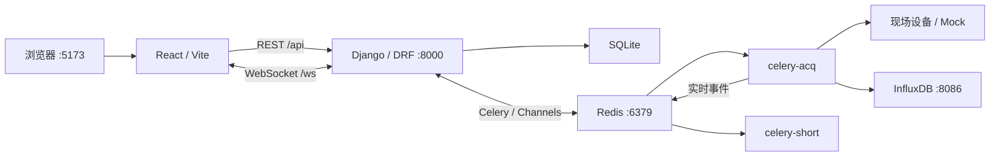

# M0 现状基线与门禁记录

更新时间：2026-08-17（Asia/Shanghai）

## 1. 状态

本记录锚定当前现场功能分支，目的是在 Vue 3/FastAPI 改写前留下可复核的现状。

- 基线分支：`feature/zhongshan-scada`
- 基线 SHA：`074c5561486d99a1999ef667dc5d9db5951a7c21`
- 集成分支：`codex/remediation-integration`
- 主远端：`origin`（GitHub）；镜像远端：`midea`
- 当前结论：**M0 准备中，尚未 accepted，禁止开始改变运行行为的迁移实现。**

未完成门禁包括：真实 Mock 全链路、SQLite/Influx 备份恢复演练、API/采集性能基线、
离线镜像回滚演练。没有对应证据时，不得把本文件当作生产验收报告。

## 2. 技术栈与服务拓扑

当前主栈是 React 18 + Vite、Django 4.2 + DRF + Channels、Celery、Redis、
InfluxDB 2.x 和 SQLite。当前 tracked tree、开发 Compose 与离线 Compose 均无 C++
后端源码、构建目标或服务。

### 2.1 开发 Compose

| 服务 | 主机端口 | 依赖/存储 | 职责 |
|---|---:|---|---|
| `redis` | 6379 | 无持久卷 | Celery broker/result、Channels layer |
| `influxdb` | 8086 | `influxdb-data`、`influxdb-config` | 时序数据 |
| `django` | 8000 | Redis/Influx；挂载 `backend/` | REST 与 WebSocket ASGI |
| `celery-acq` | - | Redis/Influx；`acquisition` 队列 | 长时采集，threads/200 |
| `celery-short` | - | Redis/Influx；`short` 队列 | 短任务，threads/8 |
| `mock-modbus` | 5020 | 只读挂载 `mock/` | Modbus TCP 模拟器 |
| `mock-mqtt` | 1883、9001 | Mosquitto 配置 | MQTT broker |
| `frontend` | 5173 | 依赖 Django | Vite 开发服务器 |

开发拓扑证据：`docker-compose.yml`。需登记的漂移：

- 开发 Redis 没有 volume/AOF，队列与 Channels 消息不是持久数据。
- 开发 `celery-short` 未带 `-B`，定时清理与会话看门狗不会随标准开发栈运行。
- Compose 映射 MQTT 9001，但 `mock/mosquitto.conf` 没有 WebSocket listener。
- Django、Celery、Frontend 和 Mock 没有 Compose 健康检查。

### 2.2 离线现场 Compose

离线栈使用 host network。默认采集模式运行 `redis`、`migrate`、`celery-acq`、
`celery-short`；`ui` profile 再运行 `django`、`web`。InfluxDB 位于 Compose 外部，
SQLite 通过 `app-db:/data` 在后端服务之间共享。

离线拓扑证据：`deploy/offline/docker-compose.offline.yml`。需登记的风险：

- Redis 无持久卷。
- Influx spill SQLite 默认位于 `/app/influx_spill.sqlite3`，没有落入 `/data` volume；
  容器替换可能丢失待回放批次。
- Compose 带默认 Influx token、Django secret 与 `DEBUG=True`；生产必须改为必填密钥。

## 3. 数据职责和 schema

### 3.1 SQLite

默认配置库为 `backend/db.sqlite3`，连接初始化为 WAL、`busy_timeout=30000`、
`synchronous=NORMAL`。主要业务表包括：

- 配置：Site、ScadaGateway、Device、Channel、PointTemplate、Point、AcqTask、TaskPoint；
- 版本/导入：ConfigVersion、ImportJob；
- 运行辅助：WorkerEndpoint、TaskRun、AcquisitionSession；
- 遗留采样：DataPoint；
- 告警：AlarmRule、Alarm。

REST 配置 CRUD、Excel apply 与版本回滚写配置表；Celery 创建和更新采集会话；
采样阈值告警由 `AlarmSink` 独立 writer 线程串行写入，但系统/连接告警以及 REST ack
仍有同步 ORM 写路径。当前实时 Pipeline 不再写 DataPoint 表，实时值进入 InfluxDB
并通过 Redis/Channels 推送，因此遗留 `/data-points/` 可能长期为空。

### 3.2 InfluxDB

业务点位默认使用设备 code（或 `device_a_tag`）作为 measurement。

- tags：`site`、`device`、`quality`，可选 `cn_name`；
- fields：测点 code 对应采样值，可选 `unit`；
- time：纳秒时间戳；
- 健康 measurement：`session_health`。

读取成功后，同一份 reading 扇出到 InfluxDB、Alarm 与 WebSocket 三个 sink。Influx
批写失败时进入独立 SQLite FIFO，成功同步回放后才删除。

### 3.3 Redis

Redis DB 0 同时承载 Celery broker/result 与 Channels layer。Channels 容量为 1500，
消息过期 10 秒；它是传输通道，不是配置或时序事实源。

## 4. 对外入口基线

HTTP 顶层入口：

- `/api/config/`：站点、设备、通道、测点、任务、SCADA、Excel、版本；
- `/api/acquisition/`：会话、连接/存储测试、协议、告警、历史查询；
- `/schema/`、`/api/docs/`、`/api/redoc/`：Django 工具路由。

WebSocket 只有两条路径，不存在 SSE 入口：

- `/ws/acquisition/sessions/{session_id}/`
- `/ws/acquisition/global/`

必须在 M1 冻结的历史差异：

- session 路径输出 `data_point`，global 路径输出 `data_point_update`；
- `session_status` 有多个 payload 形态；
- alarm 使用 `{type,event,alarm}`，不是统一 `{type,data}`；
- 没有 event id、sequence、重放或跨帧去重，交付语义是 best-effort；
- global 前端每 3 秒通过 REST 轮询 active sessions 兜底；
- REST 与 WebSocket 当前都未强制登录，迁移不得无意改变兼容行为。

完整 REST 路由、字段、分页、错误、WebSocket 和 Excel 表头将在 M1 生成机器可执行契约。

## 5. 当前基线风险

1. `start-task` 在 HTTP 请求内同步连接并读取现场设备，之后固定等待 0.5 秒；所谓
   5 秒预算并非每个阻塞协议调用的硬超时，是接口慢的重要原因。
2. 两套任务 start/stop 路径并存，状态码和响应结构不同。
3. DRF Decimal 输出字符串，但部分前端 TypeScript DTO 声明为 number。
4. v2、legacy 与 SCADA Excel 导出可能包含 MQTT/OPC UA 明文密码；生产导出不得作为
   fixture 或提交到 Git。
5. SQLite 使用 WAL，现有文档中的在线 `cp db.sqlite3` 不是一致性备份。
6. Influx spill DB 未在离线部署持久化。
7. 当前标记为 e2e 的多数测试使用 fake transport，不代表真实 Redis/Influx 全链路。
8. CI 的 pull request 触发器只面向 `master`；里程碑 PR 仍需依赖分支 push 检查，
   后续应让集成分支也触发 PR CI。

## 6. C++ 排除审计

下列审计结果必须持续保持：

- tracked tree 没有 `backend_cpp/`、C/C++ 后端源码、CMake、Conan 或 vcpkg 配置；
- 开发/离线 Compose 均无 C++ 服务；
- 两份 Dockerfile 专用 `.dockerignore` 保留 `backend_cpp`，防止本机遗留目录进入
  以仓库根为 context 的离线构建；
- `backend/Dockerfile` 中的 `gcc` 用于 Python 原生依赖，不能误判为 C++ 后端。

M1 应增加 CI guard，阻止重新提交 C++ 后端目录或构建入口。用户原工作区未跟踪的
C++ 文件不删除、不迁入新分支。

## 7. 测试证据

### 7.1 已通过

- 前端 `npm ci`：509 packages，exit 0；
- 前端 lint：0 error、0 warning；
- 前端 Vitest：12/12 files、82/82 tests；
- 前端生产构建：3916 modules，exit 0；
- 开发与离线 Compose：`config -q` 均 exit 0；
- `bash -n scripts/offline/*.sh reset_influxdb.sh`：exit 0；
- C++ tracked-tree/Compose 审计：未发现 C++ 后端；
- 后端全量用例：1268 passed、1 skipped。因 Docker Desktop 不支持从 `/private/tmp`
  正确 bind-mount 单文件，先在隔离 worktree 跑出 1224 passed、1 skipped，唯一未通过
  的 44 条均属于两个真实 Mosquitto 文件；随后在同一基线 SHA 的 `/Users` 工作区单独
  复跑这 44 条，结果 44 passed；
- 后端 e2e 子集：29 passed、1240 deselected。

### 7.2 环境限制（不计为代码结果）

- macOS 沙箱中的首次后端测试因禁止监听本地测试端口而失败；
- Docker Desktop 总内存约 1.9 GiB，且已有用户服务容器常驻。amd64 模拟和原生
  arm64 Python 3.10 临时容器均被 OOM 以 137 终止，因此未取得容器内 pytest 结论；
- 本机有效后端结果来自 Python 3.9.6。push 后仍需由仓库 CI 的目标 Python 环境再次
  验证；不得用上述容器 OOM 代替 CI 结论。

### 7.3 M0 accepted 前必须补齐

- GitHub CI 的 Python 3.10 后端全量 pytest 与 e2e 子集；
- 独立测试栈的 Mock 配置→采集→Influx→API→WS→前端曲线与断连恢复；
- SQLite `PRAGMA integrity_check` 及恢复前后关键表计数；
- Influx 恢复前后 measurement/field 计数与时间范围；
- API p95、实际入库速率、丢弃/重复数及 `docker stats`；
- 旧镜像 immutable tag/digest、load、切换及回滚验证。

生产数据、现场硬件或独立 amd64 测试机未提供时，不能宣称生产备份可恢复、真实负载
达标、72 小时稳定或现场协议/TLS 全兼容。
